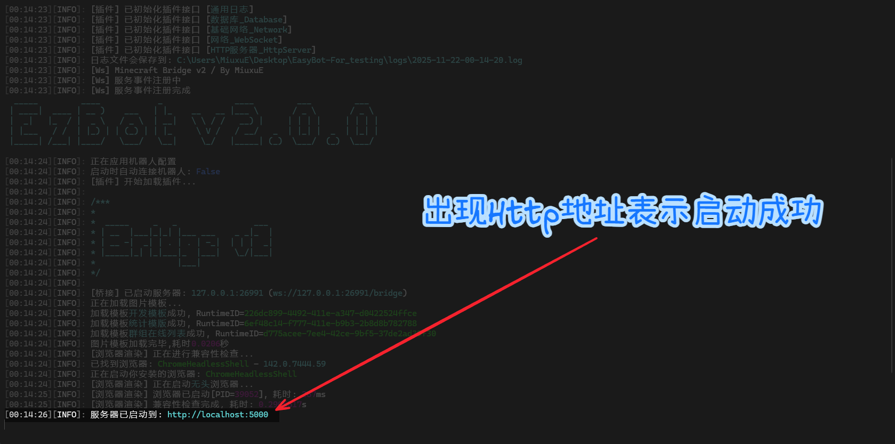
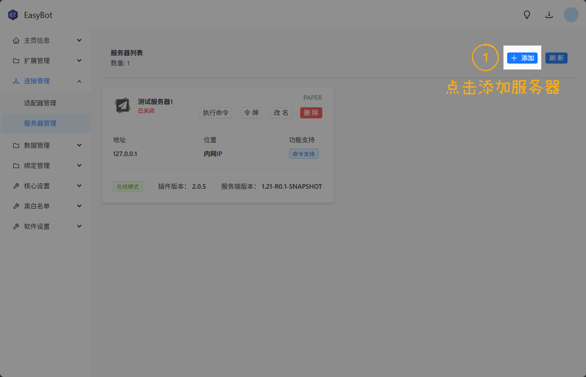
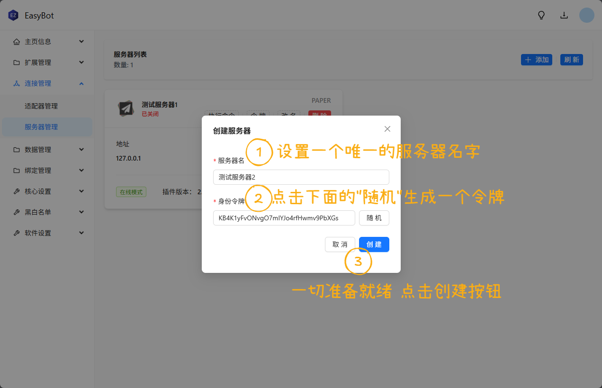
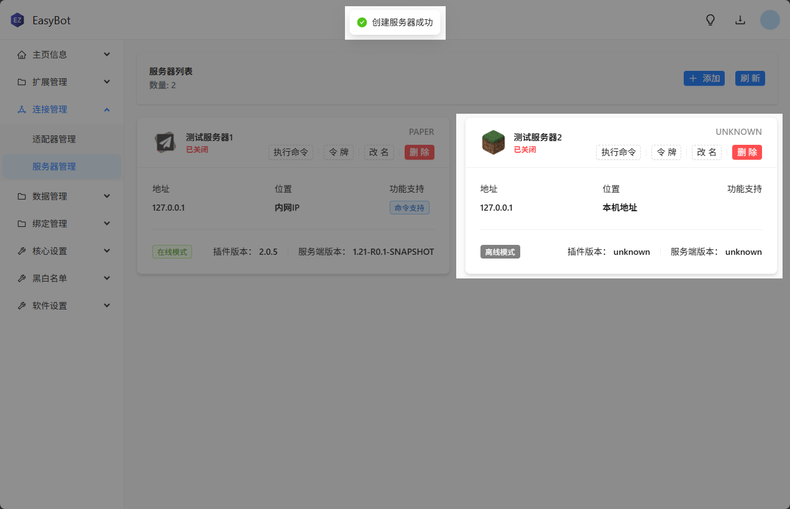
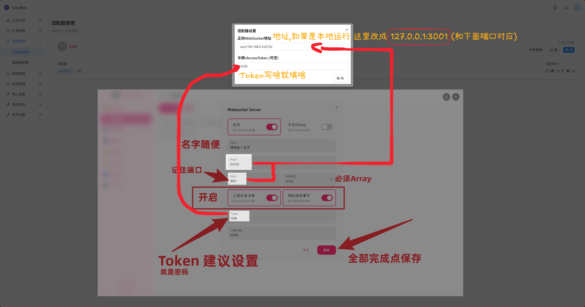
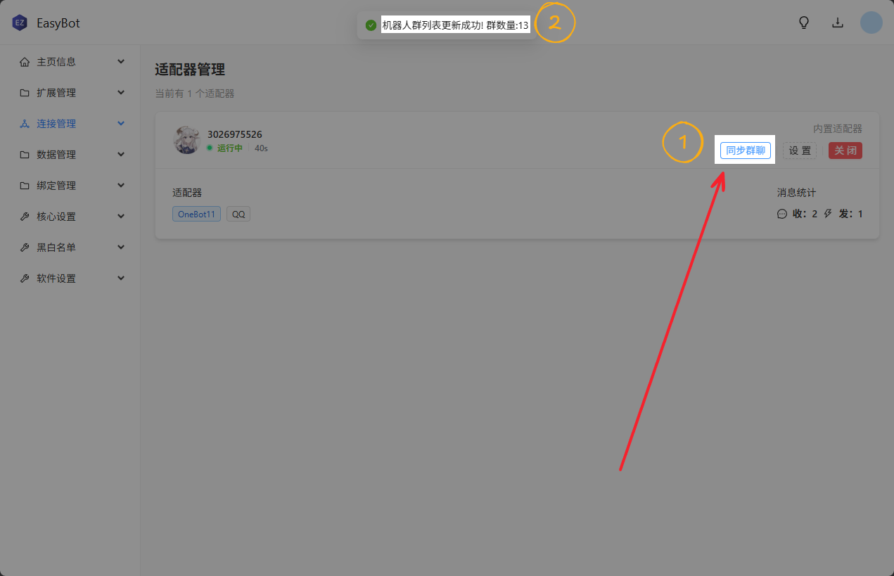
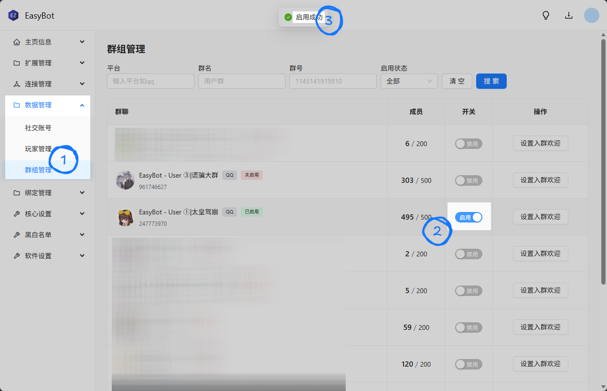

---

# 🌐 基于 EasyBot 的 QQ 群机器人：实现 Minecraft 与 QQ 群双向互通

> **目标**：搭建一个支持 **Minecraft 服务器 ↔ QQ 群** 消息互传的自动化机器人系统，实现跨平台实时通信。

---

## 🧱 第一部分：Minecraft 服务器部署（准备工作）

### ✅ 1. 系统要求

| 项目          | 要求                                                      |
|-------------|---------------------------------------------------------|
| **操作系统**    | Windows / Linux / macOS                                 |
| **Java 版本** | **Java 17**（Minecraft 1.18+ 推荐；1.20+ 官方推荐 Java 17 或 21） |
| **内存**      | ≥2 GB（建议 ≥4 GB 以保障稳定性）                                  |
| **网络**      | 稳定公网或内网连接                                               |

> 💡 **提示**：[Paper](https://papermc.io) 支持 Minecraft 1.8 ~ 最新版（如 1.21），请根据目标版本选择对应 Java。

---

### 🔧 2. 安装 Java

#### ▸ Windows / macOS
1. 访问 [Adoptium (Eclipse Temurin)](https://adoptium.net/) 下载 **JDK 17 (LTS)**。
2. 安装后验证：
   ```bash
   java -version
   ```
   应输出类似：
   ```
   openjdk version "17.0.x" 202x-xx-xx
   ```

#### ▸ Linux（Ubuntu 示例）
```bash
sudo apt update
sudo apt install openjdk-17-jre-headless -y
java -version
```

---

### 📥 3. 下载 Paper 服务端

1. 打开官方构建页 👉 [https://papermc.io/downloads](https://papermc.io/downloads)
2. 选择目标 Minecraft 版本（如 `1.20.4`、`1.21`）
3. 下载最新 `.jar` 文件（例如 `paper-1.21-123.jar`）
4. 存放至专用目录，如：
   ```
   ~/mc-server/
   ```

---

### ⚙️ 4. 首次启动 & 接受 EULA

进入目录并启动：
```bash
cd ~/mc-server
java -jar paper-1.21-123.jar
```

> ⚠️ **首次运行会失败**，并生成 `eula.txt`。

编辑 `eula.txt`：
```diff
- eula=false
+ eula=true
```

再次启动：
```bash
java -jar paper-1.21-123.jar
```
此时将生成完整目录结构（`world/`, `plugins/`, `server.properties` 等）。  
按 `Ctrl + C` 停止服务。

---

### 🛠️ 5. 基础配置（`server.properties`）

| 配置项             | 推荐值                  | 说明                       |
|-----------------|----------------------|--------------------------|
| `server-port`   | `25565`              | 默认端口                     |
| `online-mode`   | `true` / `false`     | 正版验证（`false` 允许离线登录，有风险） |
| `max-players`   | `20`                 | 最大并发玩家数                  |
| `level-name`    | `world`              | 主世界名称                    |
| `difficulty`    | `normal`             | 游戏难度                     |
| `view-distance` | `8`                  | 视距（建议 6–10）              |
| `motd`          | `A Minecraft Server` | 服务器描述（显示在列表中）            |

> 💡 **建议**：配置完成后重启服务器生效。

---

### 🔄 6. 启动脚本（推荐使用）

#### ▸ Linux / macOS (`start.sh`)
```bash
#!/bin/bash
java -Xms2G -Xmx4G -XX:+UseG1GC -jar paper-1.21-123.jar nogui
```
赋予执行权限：
```bash
chmod +x start.sh
```

#### ▸ Windows (`start.bat`)
```bat
@echo off
java -Xms2G -Xmx4G -XX:+UseG1GC -jar paper-1.21-123.jar nogui
pause
```

> **参数说明**：
> - `-Xms2G`：初始堆内存 2GB
> - `-Xmx4G`：最大堆内存 4GB
> - `-XX:+UseG1GC`：启用高效垃圾回收器
> - `nogui`：禁用图形界面，节省资源

---

### 🧩 7. 插件安装（后续用于集成 EasyBot）

1. 停止服务器
2. 将 `.jar` 插件放入 `plugins/` 目录
3. 重启服务器，插件自动加载并生成配置

> ⚠️ **注意**：确保插件与 Minecraft 版本兼容！

---

### 📚 附录：官方资源

- **Paper 官网**：[https://papermc.io](https://papermc.io)
- **插件平台**：[Hangar](https://hangar.papermc.io)｜[SpigotMC](https://www.spigotmc.org)
- **Minecraft Wiki**：[https://minecraft.wiki](https://minecraft.wiki)

✅ **至此，Minecraft 服务器已准备就绪！**

---

## 🤖 第二部分：安装 EasyBot 并对接 Minecraft 服务器

EasyBot 是基于 **.NET 8 Blazor** 开发的跨平台工具，用于桥接 Minecraft 与外部消息平台（如 QQ）。

---

### 📦 第一步：安装运行环境

> ⚠️ **注意**  
> EasyBot 依赖 .NET 8 运行时环境。若未正确安装所需组件，程序将无法启动。

#### 安装方式对比

| 方式       | 适用场景               | 说明             |
|----------|--------------------|----------------|
| **自动安装** | Windows 10/11 较新版本 | 系统自动下载并安装所需运行库 |
| **手动安装** | 所有 Windows 版本      | 用户需自行下载安装运行环境  |

---

### 🔧 手动安装步骤

#### 1. 安装 .NET 8.0 Runtime
这是 EasyBot 的基础运行环境。

📥 [下载 .NET 8.0 Runtime (v8.0.4) - Windows x64 Installer](https://dotnet.microsoft.com/download/dotnet/8.0)
> 选择 **“Runtime”** 类型，文件名通常为 `dotnet-runtime-8.0.4-win-x64.exe`

#### 2. 安装 ASP.NET Core 8.0 Runtime
EasyBot 使用 Blazor 技术，需额外安装 Web 运行时。

📥 [下载 ASP.NET Core 8.0 Runtime (v8.0.4) - Windows x64 Installer](https://dotnet.microsoft.com/download/dotnet/8.0)
> 选择 **“ASP.NET Core Runtime”**，文件名通常为 `aspnetcore-runtime-8.0.4-win-x64.exe`

> ✅ **重要提示**：以上两个组件 **必须全部安装**，否则程序无法启动！

---

### ⚠️ 兼容性补充说明

#### 旧版或精简版 Windows 用户
如果你使用的是 **Windows 7/8** 或经过精简的系统（如某些 Ghost 系统），可能还需安装 .NET Framework 4.8：

📥 [下载 .NET Framework 4.8](https://dotnet.microsoft.com/download/dotnet-framework/net48)

#### 常见错误处理
- **错误提示**：“无法运行此程序，因为缺少 xxx.dll”
- **解决方案**：
    1. 确保已安装上述两个 .NET 8 组件；
    2. 若仍报错，请安装 [.NET Desktop Runtime 8.0](https://dotnet.microsoft.com/download/dotnet/8.0)；
    3. 安装最新版 [Microsoft Visual C++ Redistributable](https://aka.ms/vs/17/release/vc_redist.x64.exe)。

---

### 🚀 第二步：安装 EasyBot 程序

> ✅ 请确认运行环境已安装完毕后再进行此步骤。

📥 [Windows 下载](https://docs.inectar.cn/download/easybot/?channel=dev)  
📦 所有版本（含 Linux）：[https://files.inectar.cn/easybot/dev](https://files.inectar.cn/easybot/dev)

#### 安装方法
1. 下载对应系统的 **压缩包（x64）**；
2. 解压到任意目录（如 `C:\EasyBot`）；
3. 双击运行 **`EasyBot.exe`** 即可启动程序。

>   
> 🔒 **无需安装，解压即用**

---

### 🧩 第三步：安装 Bukkit 插件（用于 Minecraft 服务器集成）

> 适用于 **CatServer 1.12.2** 环境  
> 支持 Minecraft ≥1.9 版本。

#### 安装流程

1. **在主程序中添加服务器**
    - 打开 EasyBot 主程序；
    - 进入 **服务器列表 → “+ 添加”**；
    - 填写服务器信息，系统将自动生成 **Token**。
   >   
   >   
   > 

2. **下载并安装插件**  
   📥 [立即下载 EasyBot Bukkit 插件](https://docs.inectar.cn/download/easybot_plugin/?state=bukkit)
    - 将 `.jar` 文件放入 `plugins/` 目录；
    - 首次启动服务器，插件将自动生成配置文件。

3. **配置插件**  
   编辑 `plugins/EasyBot/config.yml`：
   ```yaml
   service:
     token: "你的Token"
   ```
   > 

4. **启动服务器**
    - 重启 Minecraft 服务器；
    - 查看控制台日志，若出现 **“插件已成功连接”**，表示配置成功。

---

### ❓ 常见问题

| 问题             | 解决方案                                            |
|----------------|-------------------------------------------------|
| **程序闪退或打不开？**  | 检查是否完整安装了 .NET 8 Runtime 和 ASP.NET Core Runtime |
| **插件无法连接主程序？** | 确认 Token 是否填写正确，且主程序处于运行状态；检查防火墙是否阻止通信          |

> 📌 **提示**：建议始终使用最新稳定版以获得最佳体验。开发版仅用于测试新功能。

✅ **下一步**：配置 NapCat 对接 EasyBot，实现 **QQ ↔ MC 双向消息同步**。

---

## 🤖 第三部分：NapCat 搭建 && QQ登录

---

### 📌 什么是 NapCat？

> NapCat 是基于 [Shamrock](https://yuyue-amatsuki.github.io/OpenShamrock/) 的 **OneBot v11 实现**，可在 PC 上运行 QQ 客户端并通过 WebSocket/HTTP 提供机器人接口。  
> 常用于配合 **NoneBot、Koishi** 等框架。

> ⚠️ **重要提醒**：  
> NapCat 需扫码登录真实 QQ 账号，**可能违反腾讯《QQ 软件许可协议》**，存在封号风险。  
> **仅限个人学习使用，禁止商业或群控行为。**

---

### 🐳 使用 Docker 部署 NapCat（Linux 环境）

#### 🔧 前提条件
- 已安装 [Docker](https://docs.docker.com/engine/install/)
- （推荐）已安装 [Docker Compose](https://docs.docker.com/compose/install/)
- 可访问图形界面（用于扫码）或配置 VNC/X11 转发（无头服务器）

---

#### 📂 1. 创建项目目录
```bash
mkdir napcat && cd napcat
```

#### 📄 2. 编写 `docker-compose.yml`
```yaml
version: "3"
services:
  napcat:
    environment:
      - NAPCAT_UID=${NAPCAT_UID}
      - NAPCAT_GID=${NAPCAT_GID}
    ports:
      - "3000:3000"   # HTTP API
      - "3001:3001"   # WebSocket
      - "6099:6099"   # WebUI
    container_name: napcat
    network_mode: bridge
    restart: always
    image: mlikiowa/napcat-docker:latest
```

> 💡 **启动命令**：
> ```bash
> NAPCAT_UID=$(id -u) NAPCAT_GID=$(id -g) docker-compose up -d
> ```

---

#### 🔐 3. 扫码登录

1. 访问 WebUI：  
   👉 `http://<你的服务器IP>:6099/webui`
2. **默认密码**：`napcat`
3. 使用手机 QQ 扫码登录

>   
>   
> 

---

### 🔗 参考资源

- **NapCat GitHub（非官方）**：[https://github.com/NapNeko/NapCat](https://github.com/NapNeko/NapCat)
- **社区 Docker 镜像示例**：[chenzhenyu1998/napcat-docker](https://hub.docker.com/r/chenzhenyu1998/napcat-docker)
- **OneBot v11 标准**：[https://github.com/botuniverse/onebot-11](https://github.com/botuniverse/onebot-11)

---

## 🌉 第四部分：联动配置

### 1️⃣ 在 NapCat 侧边栏配置 WebSocket 服务器

1. 打开 NapCat 客户端。
2. 左侧点击 **“网络配置”**。
3. 点击 **“新建 WebSocket 服务器”**。

>   
> 

> ✅ 此时 NapCat 已开始在指定端口监听 WebSocket 连接。

---

### 2️⃣ 在 EasyBot 中连接 NapCat

通过 EasyBot Web UI 进行设置：

> 

> ⚠️ **跨主机连接提示**：  
> 如果 EasyBot 与 NapCat 不在同一台机器，请确保宿主机防火墙允许对应端口通信。

---

### 3️⃣ 启用群聊功能

EasyBot 默认**全群关闭**，需手动启用特定群聊：

>   
> 

---

### 📚 进阶参考

- [NapCat 官方文档](https://napneko.github.io/guide/napcat)
- [EasyBot 官方文档](https://docs.inectar.cn/docs/easybot/features/bind/)

---

> ✅ **恭喜！你已完成 Minecraft 与 QQ 群的双向互通搭建！**  
> 现在玩家在游戏中的聊天将同步到 QQ 群，QQ 群消息也将广播至 Minecraft 服务器。