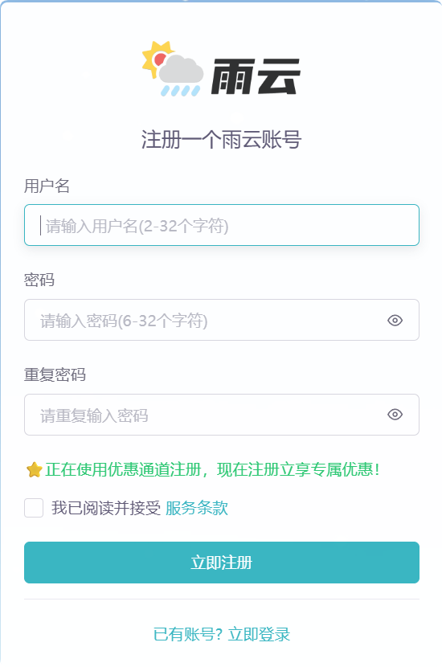

# 云服务商推荐 - 阿里云/雨云优惠活动

在数字化时代，选择一个稳定、高效的云服务商对于个人开发者和企业都至关重要。今天为大家推荐两家优质的云服务商：阿里云和雨云，目前都有不错的优惠活动。

## 阿里云推荐

阿里云是全球知名的云计算及人工智能科技公司，提供全面的云计算服务，包括云服务器、数据库、存储、网络等。

### 优惠信息
- **折扣优惠**：使用专属优惠链接可享 **8.5 折** 优惠
- **适用对象**：新用户可享受
- **推荐配置**：
  - 个人网站/博客：1核2G，适合个人开发者和小型项目

### 阿里云优势
1. **稳定可靠**：服务稳定，SLA可达99.9%
2. **全球节点**：覆盖全球多个区域，访问速度快
3. **丰富产品线**：从基础的ECS到AI、大数据等高级服务
4. **技术支持**：7x24小时技术支持

[点击这里访问阿里云优惠页面](https://www.aliyun.com/minisite/goods?userCode=m77xupui)

## 雨云推荐

雨云是一家专注于提供高性价比云服务的厂商，特别适合个人开发者和中小型企业。

### 优惠信息
- **折扣优惠**：使用专属优惠链接可享 **8 折** 优惠 (优惠码: won)
- **适用对象**：新老用户均可享受
- **推荐配置**：
  - 入门套餐：1核1G，适合个人博客和小项目

### 雨云优势
1. **性价比高**：价格实惠，配置灵活
2. **国内节点**：国内较多多节点覆盖，访问速度快
3. **简单易用**：管理后台简洁，易于操作
4. **快速部署**：支持一键部署常用应用

[点击这里访问雨云优惠页面](https://www.rainyun.com/won_)

## 如何选择

### 选择阿里云如果您：
- 需要企业级稳定性和可靠性
- 有复杂的业务需求
- 需要全球部署
- 对技术支持要求较高

### 选择雨云如果您：
- 预算有限，追求性价比
- 主要面向国内用户
- 需要简单易用的云服务
- 个人项目或小型应用

## 注意事项

1. **按需选择**：根据实际业务需求选择合适的配置
2. **关注续费**：注意优惠价格的续费政策
3. **数据备份**：定期备份重要数据
4. **安全设置**：合理设置防火墙和安全策略

## 结语

无论选择阿里云还是雨云，都可以通过专属优惠链接享受折扣。建议根据自己的实际需求和预算进行选择，云服务的选择对于项目的稳定运行至关重要。

> **温馨提醒**：点击上方链接访问相应云服务商，即可享受专属优惠价格！
选择适合的云服务商，助力您的项目腾飞！
